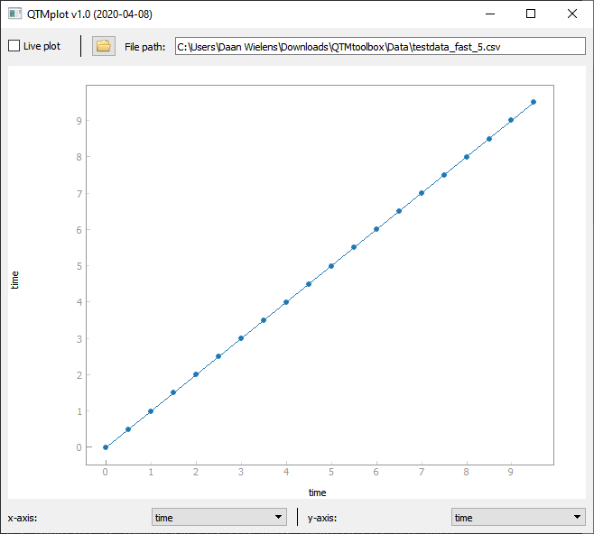

# QTM Toolbox
This repository holds the Python QTM Toolbox that can be used for transport measurements with equipment as used in the QTM/ICE research group. 

## Measurement tools
The repository contains different files and folders, organised in the following manner:
* **Measurement_script.py** is the main file of the project and is the starting point of each experiment. For every new experiment, create a new copy of this file and change it to reflect your current measurement setup.
* **functions** contains the QTMlab.py script that contains basic functions such as _move_, _sweep_, _measure_. 
* **instruments** contains definitions for all instruments that can be used during measurements. 

## Plot tools
The repository contains a simple plot tool that can plot live measurements. The tool can also quickly plot other (i.e. older) data files, as long as they are generated by the QTM Toolbox.
* **QTMplot.py** is the plot tool.

A screenshot of the plot tool is shown below. 

**Tips** 

The plot tool has a few useful keyboard shortcuts!
* Ctrl+O : pop up the 'Open file dialog' (also stops live plotting)
* Ctrl+R : rescale figure once
* Ctrl+A : enable auto rescale: the figure will continuously rescale when new data is added through the live plotting
* Ctrl+L : toggle live plotting on/off

## Documentation
A manual is supplied to help new users to setup their measurements. The manual also contains an overview of all instruments, functions, etc.
* **Manual** is a PDF file containing detailed information about how to use this Toolbox.

_The .gitignore file tells GitLab that certain files / folder should not be uploaded to this repository (such as personal configuration files) and can be ignored._